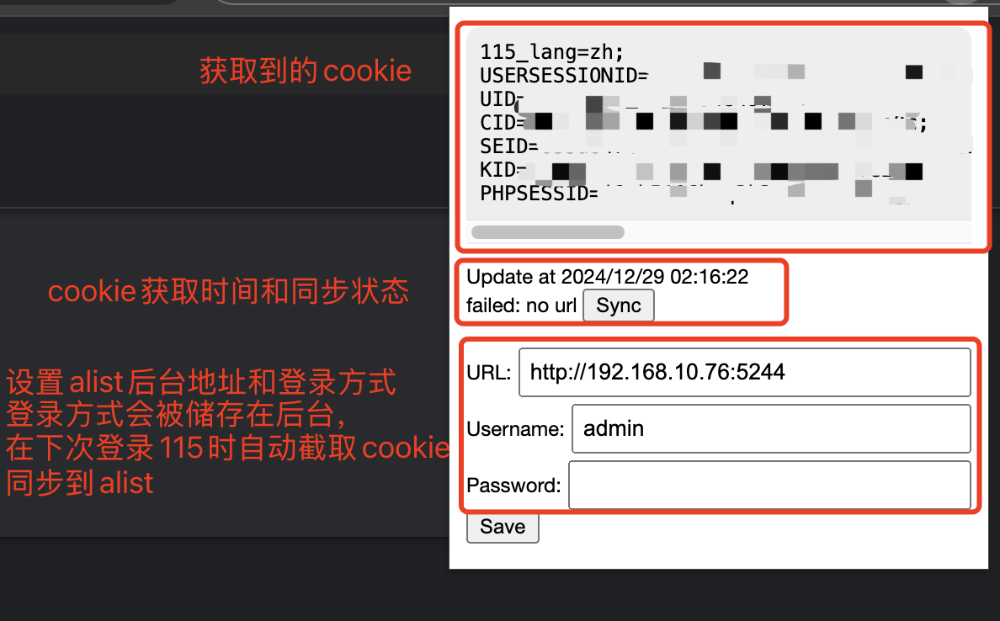

#  115ToAlist

Chrome插件，自动同步115 cookie到alist

## 使用方法

1. repo右上角 `Code` > `Download ZIP`，文件夹解压到本地
2. 打开Chrome插件开发者模式，地址栏输入 `chrome://extensions/`，右上角打开开发者模式
3. 把解压出来的文件夹拖进页面
4. 右上角打开插件页面，此时已经会显示当前截取的115 cookie，在下方填写alist后台地址和账户名密码后，下次登录115 cookie会被自动同步到alist

